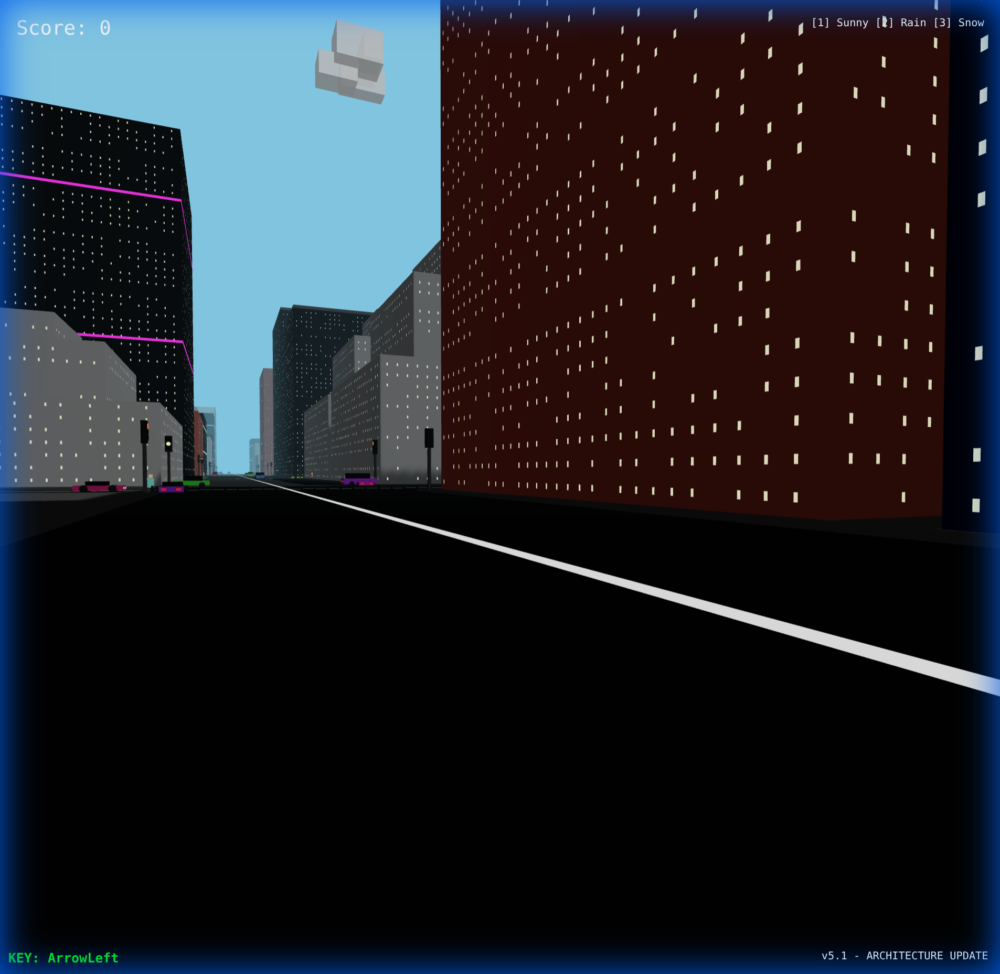
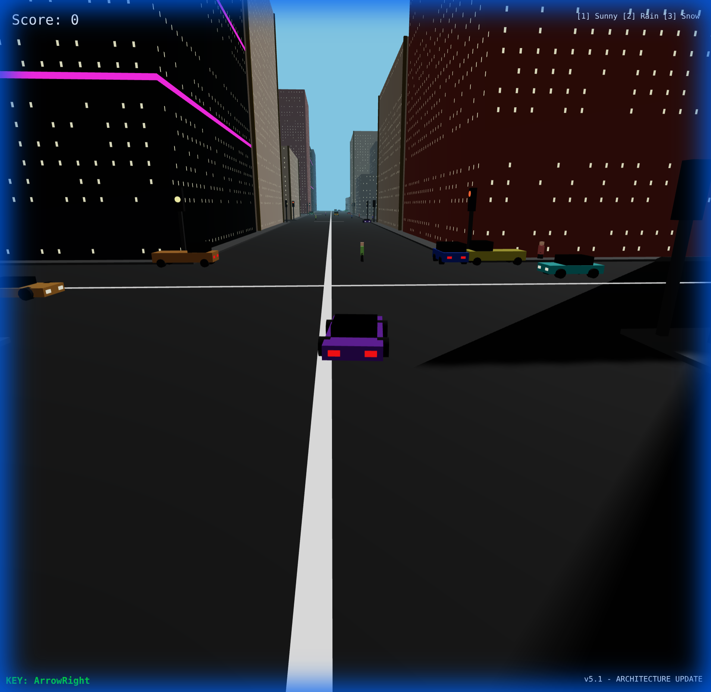
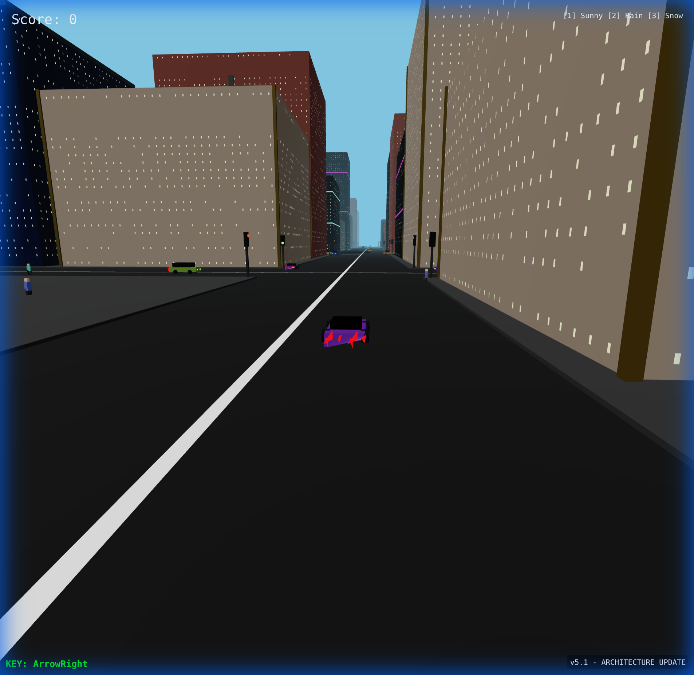

# Worldloop v5.12.0

**Worldloop** is a next-gen procedural city simulation featuring intelligent traffic, smart pedestrians, and diverse architectural styles.

## 🌟 Features
*   **Procedural City:** Infinite city generation with long boulevards and varied districts.
*   **Intelligent Traffic:** Cars obey traffic lights, stop for obstacles, and drive realistically.
*   **Smart Pedestrians:** Pedestrians walk the streets, avoid buildings, and use crosswalks safely.
*   **5 Building Styles:**
    *   Classic Setback
    *   Modern Glass (Lit Windows)
    *   Art Deco
    *   Brick Apartments
    *   Cyberpunk Neon Towers
*   **Dynamic Weather:** Switch between Sun, Rain, and Snow instantly.

## 🎮 How to Play
1.  **Start:** Click anywhere to lock cursor and begin.
2.  **Move:** `W`, `A`, `S`, `D` to walk.
3.  **Look:** Use the **Mouse** to look around.
4.  **Drive:** Press `ENTER` near a car to drive it.
5.  **Weather:** Press `1` (Sun), `2` (Rain), or `3` (Snow).

## 📸 Gallery

### Diverse Architecture

*From left to right: Cyberpunk Neon Tower, Brick Apartment, and Modern Glass Skyscrapers.*

### Living Streets

*Pedestrians navigating the sidewalks and crossing streets safely.*

---
*Created by Worldloop Team*
